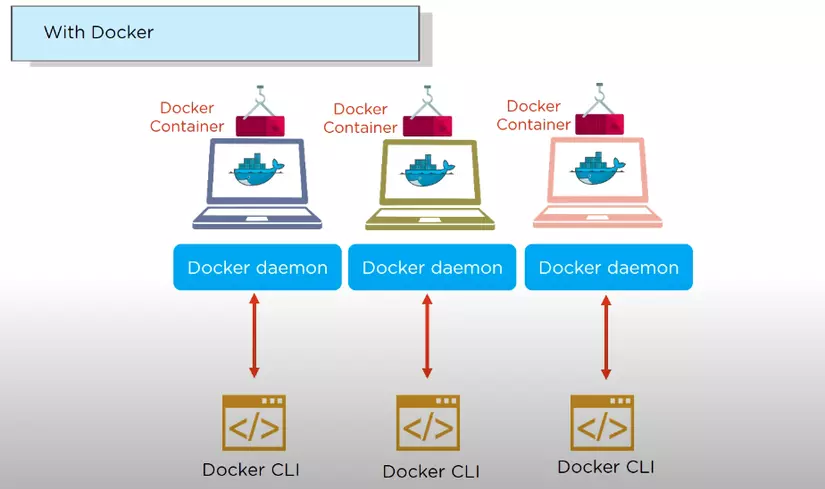
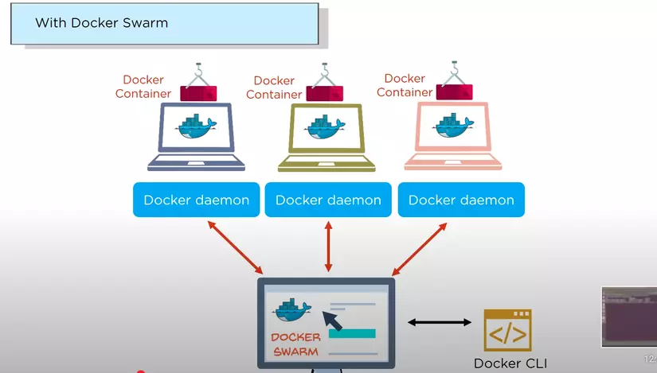
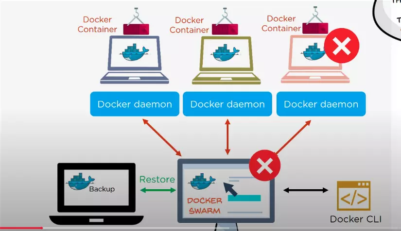
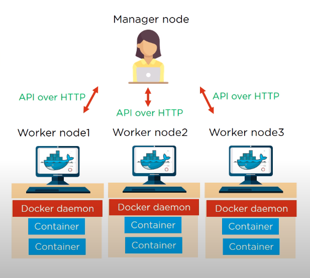

# Docker Swarm là gì ?

> **Docker Swarm**: là một service cho phép người dùng có thể tạo, quản lý tập chung cho Docker nodes và lịch trình cho các containers

> Mỗi node của một Docker Swarm là một Docker daemon và tất cả các Docker daemons đều sử dụng docker API.

> Các services có thể được deploy và có thể truy cập vào các nodes như nhau.

> Khi một container bị build lỗi, thì với một backup folder sẵn có trong node ta có thể sử dụng để restore data trên một swarm mới. Nếu bạn nào đã từng deploy và sử dụng docker trong dự án chắc chắn đã từng bị chết container. Và đơn giản với docker swarm chúng ta có thể rollback bản build trước một cách dễ dàng với Swarm.







# Các tính năng của Docker Swarm

- Truy cập phi tập trung
- Tính bảo mật cao
- Auto load balancing
- Khả năng mở rộng cao
- Có khả năng rollback tiến trình

# Kiến trúc của Docker Swarm

- Manage Node
- Worker node
- Docker daemon
- Container

> Các container được quản lý bởi các Docker daemon trong các Worker node đã được chia nhỏ và quản lý tập trung bởi Manage node.



- Manage node được hiểu là trạng thái của tất cả các Worker node trong cụm.
- Worker node chấp nhận các task được gửi từ Manage node.
- Mọi Worker node như một agent, tự động báo cáo trạnh thái task của node đến Manage node.
- Tất cả các Worker node giao tiếp với Manager node sử dụng API qua HTTP

# Command

> Tạo Swarm node - manager node (leader)

```sh
  docker swarm init --advertise-addr=<docker_machine_ip>

  docker info
```

> Kiểm tra các node trong Swarm - Manager

```sh
  docker node ls
```

> Xem token để các DM khác join vào - Manager node

```sh
  docker swarm join-token worker
```

> Worker xin join vào

```sh
  docker swarm join --token <token>
```

> Rời Swarm - Worker

```sh
  docker swarm leave
```

> Xóa 1 node ra khỏi swarm - Manager

```sh
  docker swarm rm <worker_id>
```

# Quản lý service

[Reference](https://docs.docker.com/engine/reference/commandline/service/)

> Tạo service trên Manager node

> Khi tạo các service với replicas > 1 thì node leader sẽ phân bổ cho các node trong swarm. Khi có 1 request đến service thì leader sẽ chọn ra 1 node tình trạng tốt nhất để trả về kết quả.

> Trong trường hợp 1 node xóa đi container hoặc bị shutdown, thì manager sẽ tự tạo lại container đó cho 1 node khác.

```sh
  docker service create --replicas <num_of_tasks> [OPTIONS] --name <service_name> <image>
```

> Kiểm tra các container trong 1 service

```sh
  docker service ps <service_name>
```

> Scale service

```sh
  docker service scale <service_name> = <number_of_tasks>
```
