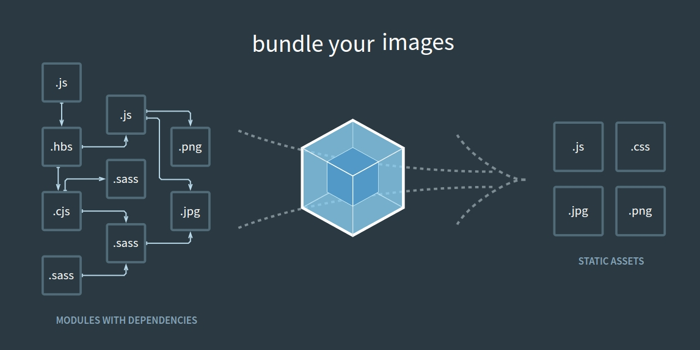

# Ưu điểm

- Bundle JS, CSS into single file.
- Minify assets
- Compile Typescript, SCSS automatically
- Optimize images, SVG
- Dev, Prod mode
- Easy build React, TS, SCSS, ...
- Babel, PostCSS, Auto prefix css, split code

# Nhược điểm

- Document khó đọc, khó để học
- Cú pháp hỗn độn
- Mất thời gian cho việc setup
