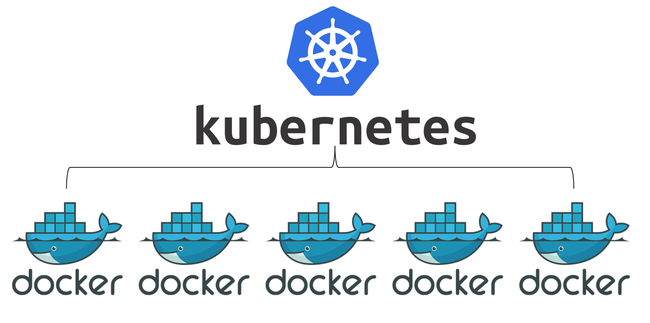
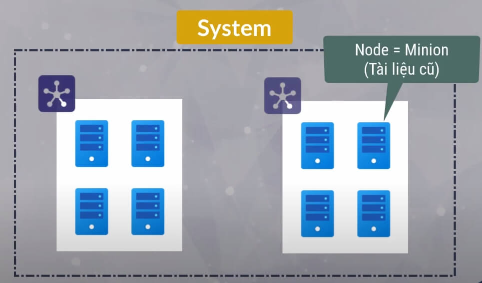
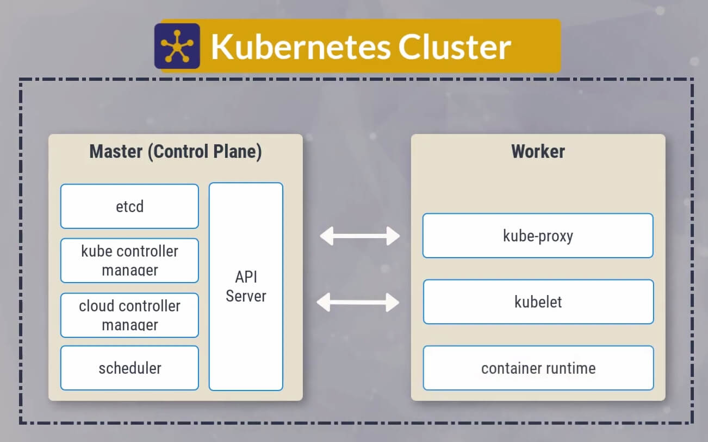
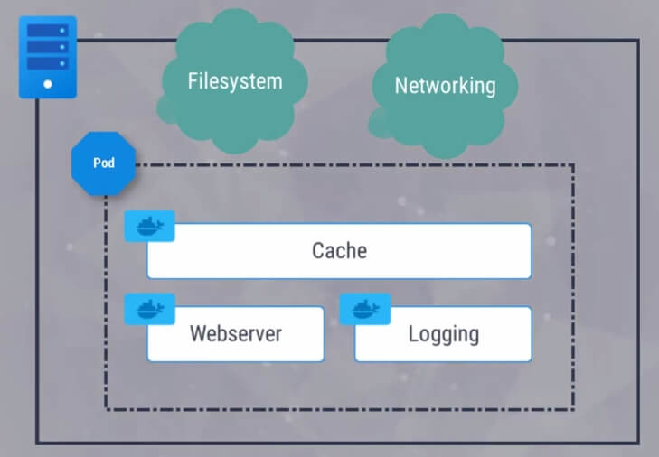
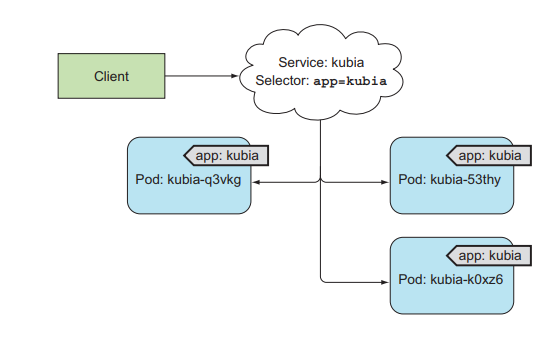
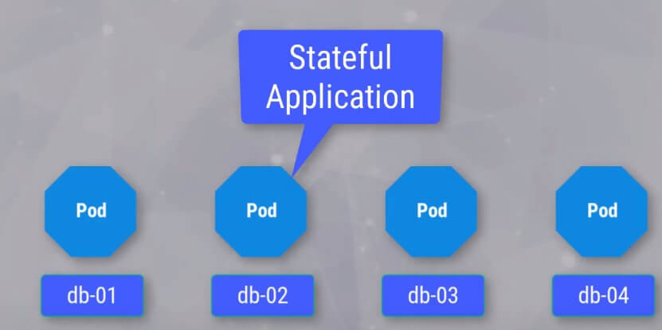
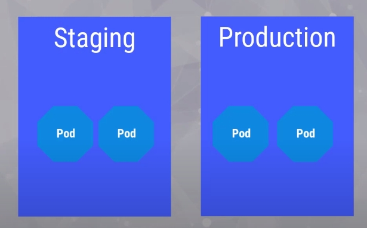

<h1 align="center">Kubernetes (k8s)</h1>

# Container Orchestration

> **Container Orchestration** là các công cụ, dịch vụ dùng để điều phối và quản lý nhiều container sao cho chúng làm việc một cách hiệu quả nhất.

> Các tính năng cần có của một Container Orchestration:

- Container Deployment: Quản lý các container, start, stop, replicate, ...
- Schedule: Lên lịch xử lý các công việc (workflow) trên các cluster nodes
- Scaling: Thay đổi số lượng container phù hợp với khối lượng công việc hiện tại.
- Networking: Liên kết các service trong cùng 1 application
- Service Discovery: Tìm kiếm các service trong 1 application.
- Resource Allocation: Phân bổ tài nguyên vào container sao cho hợp lý
- Heath Monitoring: Quản lý, kiểm soát tình trạng hoạt động của các containers.

> Lợi ích:

- High Availability
- Tối ưu hoá Computing Resources của toàn cluster.
- Tự động hoá được quá trình Deployment.
- Quản lý dễ dàng, khả năng mở rộng rất cao.

> Một vài Product liên quan:

- Docker Swarm (Đơn giản, có sẵn trong Docker)
- Kubernetes
- Apache Mesos
- ...

# Tổng quan về Kubernetes ?

- Kubernetes là 1 Container Orchestration (Deploy, Scaling, Manage), còn gọi là K8S.
- Ra đời ngày 07/06/2014 bởi Google, mã nguồn mở và trở thành 1 project của CNCF (Cloud Native Computing Foundation) năm 2016.
- Một vài công cụ cung cấp Kubernetes:

  - Google Cloud Kubernetes Engine
  - Amazon EKS
  - Azure Kubernetes Service (AKS)
  - Minikube

- Lợi ích K8S:
  - Đẩy nhanh tốc độ phát triển hệ thống.
  - Tính sẵn sàng cao (High Availability).
  - Tối ưu khả năng mở rộng (thích hợp cho các hệ thống microservice)
  - Open Source, cộng đồng hỗ trợ mạnh mẽ.

# Các thành phần chính trong Kubernetes

> **Cluster** là một tập hợp nhiều nodes, với mỗi node bao gồm các tài nguyên như memory, computing, networking, storage ,... Một system có thể có nhiều cluster.

> Master Node:

- **API Server:** cung cấp API cho k8s cluster dùng để xác thực và thiết lập các configuration data cho Pod services.

- **etcd:** Key-value storage, lưu trữ toàn bộ cấu hình, trạng thái và meta data của 1 cluster. etcd có thể chạy trên 1 node hoặc nhiều node để dự phòng (trong các hệ thống lớn).

- **kube controller manager:** Theo dõi các cập nhật trạng thái cũa k8s cluster thông qua API và cập nhật các thay đổi sao cho phù hơp.

- **cloud controller manager:** Dành cho các cloud provider.

- **Scheduler:** Lên lịch, sắp xếp, phân bổ tài nguyên cho các Pod cho hợp lý.

> Worker Node:

- **Kube-proxy** chạy trên tất cả các node trong cluster, quản lý network policy trên mỗi node, chuyển tiếp hoặc lọc traffic tới node dựa trên policy này.

- **Kubelet** là 1 Agent chạy trên mỗi Worker, giám sát, quản lý giao tiếp với Master node. Quản lý các Pod, sử dụng CRI (Container Runtime Interface) để giao tiếp với Container Runtime.

- **Container Runtime** Chịu tránh nhiệm chạy các container.

# Các khái niệm quan trọng trong Kubernetes

> **Pod** là đơn vị nhỏ nhất trong k8s, bao gồm 1 hoặc nhiều container chia sẻ tài nguyên, network với nhau.

> **Service** thực hiện chức năng discovery và load balancing cho phép tạo một điểm truy cập duy nhất đến các Pods cung cấp cùng một dịch vụ (cùng Label). Service

- **Label** cung cấp meta data nhận dạng cho các object trong k8s. 1 Object có thể có nhiều label và 1 label có thể gán cho nhiều object.

- **Annotation** như label nhưng dùng để bổ sung các meta data cho máy tính có thể hiểu như timestamp, uid, ...

- **ReplicaSet** quản lý và chạy nhiều instance. thường thiết kế cho các Stateless application.

- **StatefulSet** tương tự với ReplicaSet. Tuy nhiên, mỗi bản sao của Pod sẽ khởi chạy với tên cố định, đánh index theo thứ tự.

- **ConfigMap, Secrets** truyền các config vào các container theo dạng key-value. Secret tránh đóng gói các key nhạy cảm cùng với container.

- **Namespace** tất cả object trong k8s được deploy vào các namespace, dùng để quản lý các object trong 1 cluster. Các Pod trong namespace này có thể truy cập các pod và service của namespace khác, vì thế cần thiết lập Network Policy rõ ràng.

